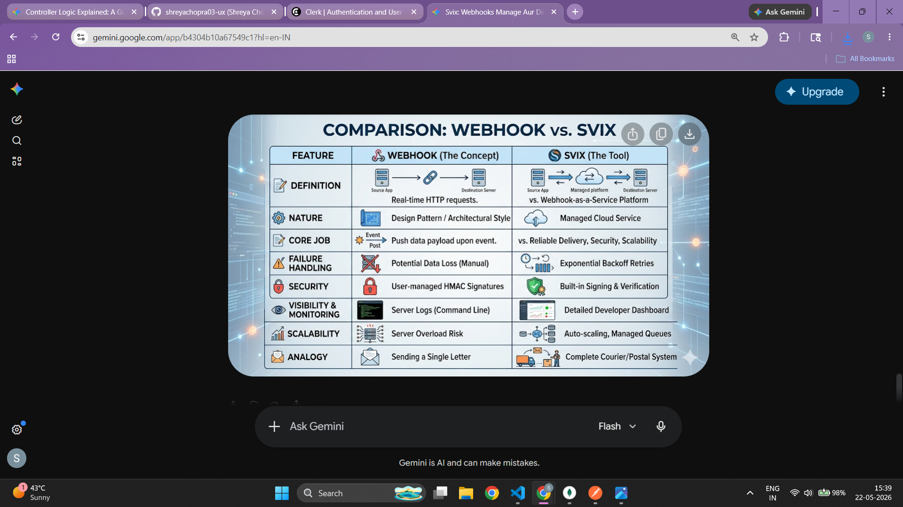

1. svix -> iska main kaam "webhooks" ko maange or deliver krne ka hota hai. ex: Agar aap Clerk ya Kinde jaise authentication providers use kar rahe hain, toh jab bhi koi naya user sign up karta hai, wo event aapke backend tak safely pahunchane ke liye peeche Svix ka use hota hai.

2. Webhook -> ek tareeka hai jisse do alag-alag web applications ya servers aapas mein real-time mein baat karte hain. for ex: Authentication (Clerk / Kinde): Jab koi naya user sign-up karta hai, toh ye services aapke server ko webhook ke zariye notify karti hain taaki aap us user ka data apne database mein save kar sakein.

3.  -> vvv imp ⭐⭐⭐⭐

4. svix -> Iska kaam wahi hai: Yeh check karna ki jo data hamare backend par aa raha hai, wo sach mein Clerk ke server ne bheja hai, na ki kisi hacker ya malicious website ne.

5. app.use(express.json()); => ye data ko js object mei convert krdeta hai

6. difference between js object & json ⭐⭐

7. Multer frontend se photo ko backend tak lekar aata hai, aur Cloudinary us photo ko backend se lekar hamesha ke liye cloud par save kar deta hai.

8. Postman/Frontend ──(Photo Bheji)──>
Multer ──(Photo Pakad Kar Code Ko Di)──>
Cloudinary ──(Photo Apne Paas Save Karke URL Diya)──>
MongoDB ──(Sirf URL Link Save Kiya)──> DONE!

9. exifr ek bohot hi fast aur lightweight JavaScript library hai jiska main kaam Photos ke andar chhupe hue Metadata (EXIF Data) ko nikalna hai.

10. exifr basically exif date nikaal kr deta hai from the buffer data, pehle ise parse krna pdhta hai or ye buffer mei se fir humeei DateTimeOriginal nikaal kr deta hai 

11. Node.js mei buffer is also a data type, jo ye btaata hai kii ismei sirf raw data hai ya fir incoming data ka jab koi fixed type na ho jaise images, videos, audios ke case mei kuch bhi ho skta hai na isliye buffer data type aise cases mei use hota hai.

12.  EXIF (Exchangeable Image File Format) ek metadata standard hai jo photos ke andar store hota hai.
EXIFR ek JavaScript library/package hai jo images se EXIF metadata ko read karne ke liye use hoti hai.

13. 